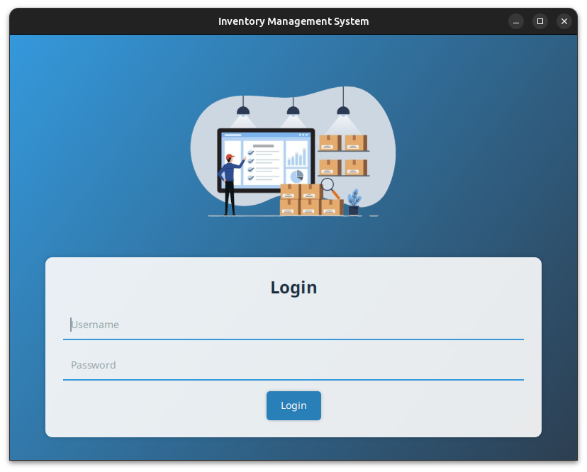
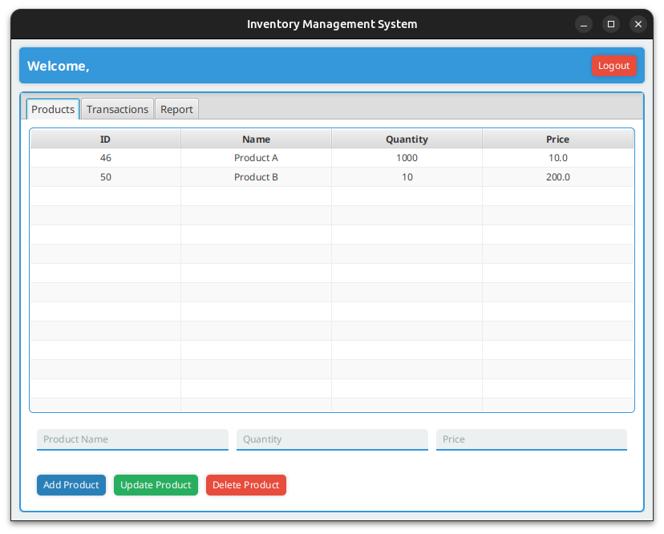
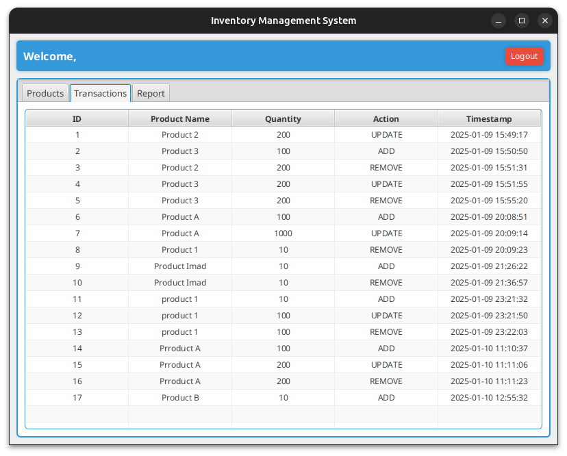
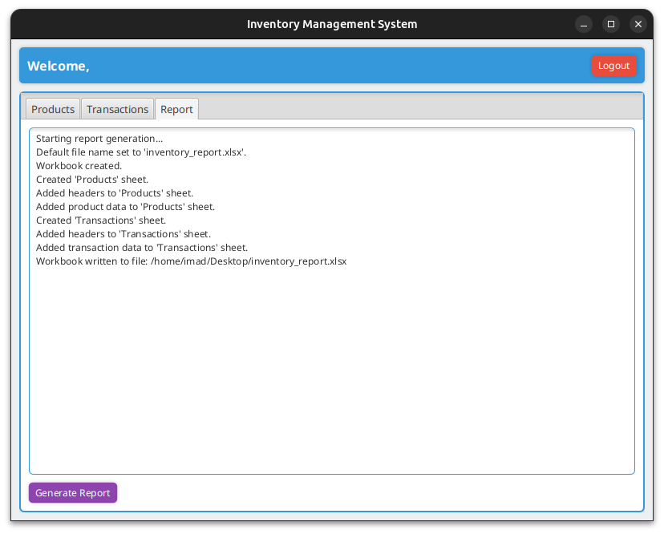

## **Inventory Management Blockchain**

This project is an inventory management system that leverages blockchain technology to ensure the integrity, transparency, and immutability of transactions. It provides a secure and decentralized way to manage products and track transactions using a blockchain.

## **Features**

1. **Product Management**:

   - Add new products to the inventory.
   - Update product details (e.g., name, quantity, price).
   - Delete products from the inventory.

2. **Transaction Tracking**:

   - Record all transactions (e.g., product additions, updates, deletions) on the blockchain.
   - View transaction history with timestamps and details.

3. **Reporting**:

   - Generate detailed reports in Excel format for inventory and transaction history.

4. **Blockchain Integration**:

   - Use Ethereum-based smart contracts to ensure data integrity and transparency.
   - Deploy and interact with the smart contract using Web3j and Truffle.

## **Setup Instructions**

### **Prerequisites**

- **Java Development Kit (JDK) 8 or higher**
- **Node.js and npm** (for Truffle and Ganache)
- **Truffle** (for smart contract deployment)
- **Ganache** (for local Ethereum blockchain simulation)
- **MySQL** (for database storage)
- **Web3j** (for Java integration with Ethereum)
- **Maven** (for building and running the JavaFX application)

### **Installation**

1. **Install Truffle globally**:

   ```bash
   npm install -g truffle
   ```

2. **Install Ganache CLI**:

   ```bash
   npm install -g ganache-cli
   ```

3. **Install Web3j**:

   ```bash
   curl -L get.web3j.io | sh && source ~/.web3j/source.sh
   ```

4. **Clone the repository**:
   ```bash
   git clone https://github.com/ImadIdaliouali/inventory-management-blockchain.git
   cd inventory-management-blockchain
   ```

### **Running Ganache**

Start Ganache CLI to simulate a local Ethereum blockchain:

```bash
ganache-cli
```

- Note the private keys and addresses provided by Ganache. These will be used to interact with the blockchain.

### **Deploying the Smart Contract**

1. Navigate to the smart contract directory:

   ```bash
   cd smart-contract
   ```

2. Compile the smart contract:

   ```bash
   truffle compile
   ```

3. Deploy the smart contract to the local blockchain:

   ```bash
   truffle migrate
   ```

   - After deployment, note the contract address and the account used for deployment.

4. Generate the Java wrapper class for the smart contract using Web3j:

   ```bash
   web3j generate truffle --truffle-json=./build/contracts/Inventory.json -o ../src/main/java -p com.enset.contracts
   ```

5. Update the `BlockchainService.java` file:
   - Replace `CONTRACT_ADDRESS` with the deployed contract address.
   - Replace `PRIVATE_KEY` with the private key of the account used for deployment.

### **Setting Up the Database**

Import the `inventory.sql` script to create tables

### **Running the Application**

Build and run the JavaFX application using Maven:

```bash
mvn clean javafx:run
```

## **Screenshots**

1. **Login**:

   

2. **Product Management**:

   

3. **Transaction History**:

   

4. **Reports**:

   
